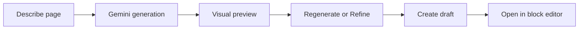

# Template Studio Roadmap

**Status:** Deferred to a future release (post WordPress.org approval)  
**Last updated:** June 2026  
**Current release focus:** MCP abilities expansion; admin UI simplified to Configuration

---

## Executive summary

Template Studio (the Generate and Preview tabs) is a **non-MCP, bring-your-own-key (BYOK) page generation feature** built on Google Gemini. It produces Gutenberg block markup and can create draft pages via REST.

The feature has a working backend but an incomplete site-owner UX (no visual preview, single-shot prompt, raw markup exposed). Rather than ship a half-finished experience during WordPress.org review, we are:

1. **Hiding** Generate and Preview from the admin UI in the current release
2. **Renaming** the top-level menu from **Page Builder** to **Configuration**
3. **Focusing** engineering on MCP abilities, skills, and connection tooling
4. **Revisiting** Template Studio in a future version once workflow and implementation strategy are defined

The REST API and PHP backend remain in the codebase for MCP agents and future UI work—they are not deleted.

---

## Decision log

| Date | Decision |
|------|----------|
| Jun 2026 | Original analysis: keep feature long-term for site owners; reposition as wizard with visual preview (not full in-admin chat) |
| Jun 2026 | **Pivot for v1.x / WP.org launch:** hide Generate/Preview UI; rename menu to Configuration; prioritize MCP abilities |

### Why defer the UI now

- **WordPress.org review** — A polished MCP + abilities story is easier to explain and support than an incomplete “AI page builder” with misleading Preview tab
- **Honest positioning** — Plugin can launch as an MCP server for AI agents (distinct from Novamira’s scope) without overpromising in-admin generation
- **Avoid trust damage** — Raw block markup, Gemini-only BYOK, and stubbed Elementor undermine first impressions
- **Engineering focus** — Abilities parity, Gutenberg queue, skills, and sandbox deliver more value to the primary launch audience (developers and agencies using MCP)

### Why keep on the roadmap (not delete)

- **Differentiator vs Novamira** — Novamira is MCP-only; in-admin generation remains a future site-owner wedge
- **Backend is real** — `TemplateStudioEndpoint`, `TemplateGenerator`, `GutenbergAdapter`, and smoke tests are implemented
- **MCP reuse** — Agents can already call `/layrshift/v1/templates/generate` and `/create` via the `template-studio` skill
- **Site-owner audience** — Still the long-term target once UX is redesigned

---

## Current release scope (pre–WP.org approval) — implemented

**Status:** Shipped in plugin admin as of Jun 2026.

### Admin UI changes

| Before | After |
|--------|-------|
| Menu: **Page Builder** | Menu: **Configuration** |
| Tabs: Generate, Preview, MCP, Settings | Tabs: **MCP**, **Settings** (Generate/Preview removed from nav) |
| Default tab: `generate` | Default tab: `mcp` |
| Tagline: “AI page builder” | Tagline: MCP-focused (e.g. “Connect AI agents”) |

### What stays in the codebase (not removed)

- `api/TemplateStudioEndpoint.php` — REST routes for agents
- `includes/Pro/*` — Gemini client, generator, adapters, settings
- `includes/skills/built-in/template-studio.md` — MCP skill documentation
- `tests/template-studio-*.php` — smoke tests
- `admin/assets/template-studio.js` — may be de-enqueued from admin; keep for future UI
- `admin/views/tabs/generate.php`, `preview.php` — keep files; unlinked from tab router

### What to prioritize instead

- New and improved **MCP abilities** (Gutenberg queue, file ops, WP-CLI, admin access, etc.)
- **Abilities Hub** polish and policy
- **MCP connection** UX (client snippets, app passwords)
- **Skills** catalog and documentation
- **Sandbox** and dev tooling for staging workflows

---

## What exists today (technical reference)

### User flow (when UI was enabled)

```
Generate tab → POST /layrshift/v1/templates/generate (Gemini BYOK)
            → sessionStorage
            → Preview tab (raw block markup textarea)
            → POST /layrshift/v1/templates/create
            → Draft page + link to block editor
```

### Key files

| Area | Path |
|------|------|
| Admin router | `admin/Admin.php` |
| Generate tab | `admin/views/tabs/generate.php` |
| Preview tab | `admin/views/tabs/preview.php` |
| Tab shell | `admin/views/partials/app-shell-open.php` |
| Frontend JS | `admin/assets/template-studio.js` |
| REST API | `api/TemplateStudioEndpoint.php` |
| Generator | `includes/Pro/TemplateGenerator.php` |
| Gemini client | `includes/Pro/GeminiClient.php` |
| Gutenberg adapter | `includes/Pro/Adapters/GutenbergAdapter.php` |
| Settings option | `layrshift_pro_settings` via `includes/Pro/ProSettings.php` |
| MCP skill | `includes/skills/built-in/template-studio.md` |

### REST endpoints (remain available for MCP)

| Route | Method | Purpose |
|-------|--------|---------|
| `/wp-json/layrshift/v1/templates/generate` | POST | AI generation from prompt |
| `/wp-json/layrshift/v1/templates/create` | POST | Create draft page from markup |
| `/wp-json/layrshift/v1/templates/settings` | PATCH | Save Gemini key and model |
| `/wp-json/layrshift/v1/templates/editors` | GET | List supported editors |

### Known gaps (why UI was deferred)

| Gap | Severity |
|-----|----------|
| No visual preview — Preview tab shows raw `<!-- wp:... -->` markup | Critical for site owners |
| Not chat — single prompt, no iteration/refine | High |
| Gemini only — no OpenAI/Anthropic despite user expectations | Medium |
| Elementor advertised but stubbed | Trust |
| API key stored plaintext in `wp_options` | Security (pre-production) |
| Title lost on Preview tab reload (`sessionStorage` bug) | Bug |
| Duplicate settings UI (Generate strip + Settings tab) | Confusion |

---

## Future release: recommended redesign

When Template Studio returns, do **not** rebuild as full in-admin chat (Claude/OpenAI/Gemini). That competes with browser chat and splits engineering from MCP.

### Recommended shape: guided page wizard



### Phase 1 — Reposition (when re-enabling)

- Single wizard flow instead of separate Generate/Preview top-level tabs
- Honest copy: “Powered by Google Gemini — bring your API key”
- Remove Elementor from UI until adapter exists
- Fix `sessionStorage` title bug
- Encrypt API keys at rest

### Phase 2 — Site-owner UX (highest ROI)

- **Real visual preview** — `do_blocks()` HTML in themed iframe or preview URL
- **Hide raw markup** behind “Advanced” toggle
- **Regenerate / Refine** — light iteration without full chat threads
- Guided BYOK onboarding (link to Google AI Studio, validation feedback)

### Phase 3 — Optional (metrics-driven)

- Multi-provider abstraction (OpenAI, Anthropic)
- Streaming responses
- Page templates / presets (“Landing”, “About”, “Contact”)
- Elementor adapter
- Hosted AI (you hold keys) if BYOK completion rate is low

### Explicitly out of scope

- Full conversational chat UI with message history
- Competing with Cursor/Claude Desktop on agent tooling
- Duplicating Gutenberg Finalizer queue in the site-owner UI

---

## Success metrics (when re-launched)

Track after visual preview + wizard ship:

- % of installs that save a Gemini key and complete **describe → visual review → draft**
- Drop-off at preview step
- Support tickets about “Preview doesn’t work” or “block markup”
- Repeat usage (second page generated without MCP)

If completion stays low, reconsider hosted AI or narrowing to MCP-only permanently.

---

## Positioning notes

| Product | Role |
|---------|------|
| **LayrShift (v1 launch)** | MCP server + abilities for AI agents on WordPress staging/dev sites |
| **Novamira** | MCP-only; no in-admin generation |
| **Template Studio (future)** | Non-MCP BYOK page creation for site owners inside wp-admin |

---

## Related documentation

- Agent spec: `agents-specification/layrsoft/specification.md` §6 (Template Studio REST)
- MCP skill: `includes/skills/built-in/template-studio.md`
- Original strategic analysis: `.cursor/plans/template_studio_strategy_651c1fcd.plan.md`
